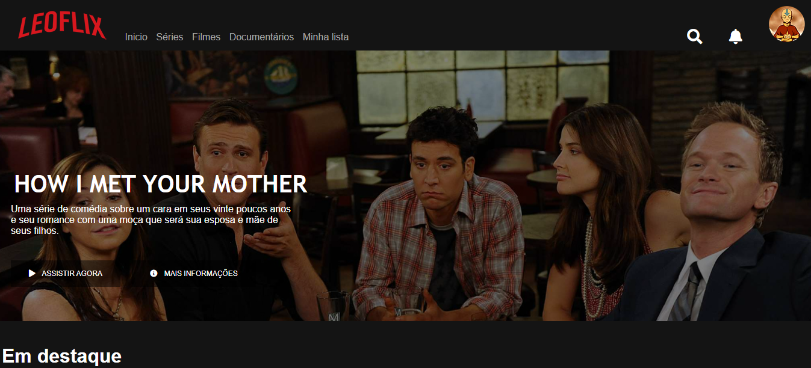

# Leoflix
Projeto clone da Netflix

Este é um <b>código HTML</b> para um site <i>clone da Netflix</i>. Inclui um cabeçalho com uma barra de navegação, ícone de pesquisa e notificação, uma seção principal com um filme em destaque e dois botões e uma seção com um <b>carousel</b> de filmes categorizados por gênero. 

O código importa <i>dois arquivos CSS</i>, <b>"main.css"</b> e <b>"responsive.css"</b>, e dois arquivos CSS de owl carousel, <b>"owl.carousel.min.css"</b> e <b>"owl.theme.default.min.css"</b>. 

O cabeçalho contém uma imagem de logotipo, cinco links para diferentes seções do site e um div com dois ícones e um link para uma imagem de avatar. 

A <b>seção principal</b> possui um container div com um título, uma descrição e dois botões que permitem ao usuário assistir ao filme ou obter mais informações sobre ele. 

Por fim, a seção carrossel contém dois <b>owl carousel</b>, cada um com um título e várias imagens de filmes categorizados por gênero. As imagens estão contidas em divs com a classe "item", e cada imagem possui um <b>atributo alt</b> descrevendo o filme (para a acessibilidade).